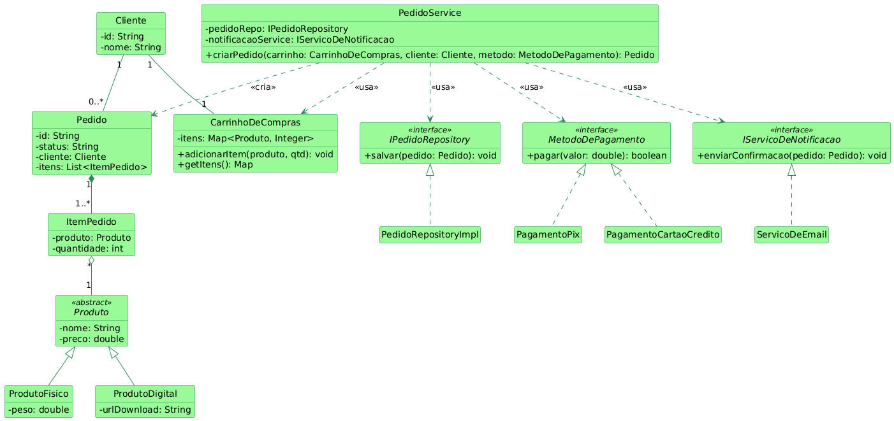

# Projeto de E-commerce para Projetos e Arquitetura de Sistemas

Este é um projeto acadêmico desenvolvido para a disciplina de **Projetos e Arquitetura de Sistemas**. O objetivo principal é projetar e implementar um sistema de software simples para um e-commerce, aplicando rigorosamente os cinco princípios SOLID de design de classes.

O sistema simula o fluxo básico de uma compra: um cliente adiciona produtos a um carrinho, finaliza a compra, o pagamento é processado e o pedido é salvo e notificado.

## Conceito SOLID

O design deste projeto foi guiado pelos cinco princípios SOLID para garantir um código limpo, manutenível e extensível.

* **S - Single Responsibility Principle (Princípio da Responsabilidade Única)**
    * Cada classe possui uma única e clara responsabilidade. `PedidoService` orquestra o fluxo do pedido, `PedidoRepositoryImpl` lida com a persistência, `ServicoDeEmail` é responsável pelo envio de notificações, e as classes de pagamento cuidam apenas do processamento financeiro.

* **O - Open/Closed Principle (Princípio Aberto/Fechado)**
    * O sistema é aberto à extensão, mas fechado para modificação. A interface `MetodoDePagamento` permite que novos tipos de pagamento (como `PagamentoBoleto`) sejam adicionados ao sistema sem que nenhuma linha de código precise ser alterada no `PedidoService`.

* **L - Liskov Substitution Principle (Princípio da Substituição de Liskov)**
    * As subclasses podem substituir suas superclasses sem afetar o comportamento do sistema. As classes `ProdutoFisico` e `ProdutoDigital` herdam de `Produto` e podem ser usadas em qualquer lugar onde um `Produto` é esperado (como no `CarrinhoDeCompras`) de forma intercambiável.

* **I - Interface Segregation Principle (Princípio da Segregação de Interfaces)**
    * As interfaces são pequenas e focadas em um único contrato. Em vez de uma grande "InterfaceDeSistema", temos interfaces específicas como `IPedidoRepository` e `IServicoDeNotificacao`, garantindo que as classes implementem apenas os métodos que lhes competem.

* **D - Dependency Inversion Principle (Princípio da Inversão de Dependência)**
    * Módulos de alto nível (`PedidoService`) dependem de abstrações (interfaces), e não de implementações concretas. As dependências (`IPedidoRepository`, `IServicoDeNotificacao`) são fornecidas de fora (Injeção de Dependência), o que é demonstrado na classe `Main`.

## Diagrama de Classes

O diagrama abaixo representa a arquitetura final implementada no projeto.

## Autores

* Autor 1: Gigio Moura Melo
* Autor 2: Samuel De Francesco Lima Tavares Lopes